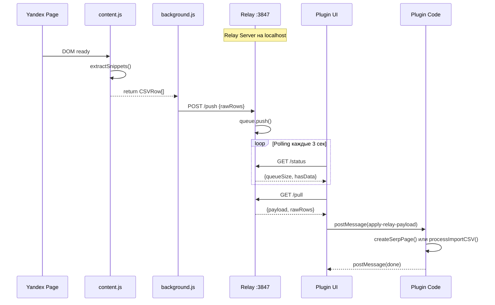

# Архитектура Contentify

Детальная карта проекта для понимания всех компонентов системы.

## Обзор системы

Contentify — это связка из трёх компонентов для автозаполнения Figma-макетов данными из поисковой выдачи Яндекса.



---

## Figma Plugin

### Entry Points

| Файл | Thread | Описание |
|------|--------|----------|
| `src/code.ts` | Sandbox | Главная логика плагина, Figma API |
| `src/ui.tsx` | UI (iframe) | React-интерфейс, парсинг файлов |

### Поток обработки данных

```
HTML/MHTML файл или Relay Payload
    ↓
UI: parseYandexSearchResults() → CSVRow[]
    ↓
postMessage({ type: 'import-csv', rows, scope })
    ↓
Code: processImportCSV()
    ├── collectContainers() — поиск контейнеров в Figma
    ├── assignRowsToContainers() — маппинг по типам
    ├── createLayerData() — связь слоёв с данными
    ├── handlerRegistry.executeAll() — компонентная логика
    ├── processTextLayers() — установка текстов
    └── imageProcessor.processPool() — загрузка изображений
    ↓
postMessage({ type: 'done', count })
```

### Handler Registry

Централизованная система обработчиков компонентов.

**Приоритеты выполнения:**

| Приоритет | Название | Handlers |
|-----------|----------|----------|
| 0 | CRITICAL | EPriceGroup, EPriceView |
| 10 | VARIANTS | BrandLogic, EOfferItem, EShopItem, ESnippetProps |
| 20 | VISIBILITY | EButton, OfficialShop, InfoIcon |
| 30 | TEXT | LabelDiscountView, ShopOfflineRegion, QuoteText |
| 40 | FALLBACK | ESnippetOrganicTextFallback, MetaVisibility |

**Режимы выполнения:**
- `sync` — синхронное выполнение
- `async` — асинхронное, но последовательное
- `parallel` — параллельное выполнение независимых handlers

**Регистрация handler:**

```typescript
handlerRegistry.register('MyHandler', handleMyFeature, {
  priority: HandlerPriority.VARIANTS,
  mode: 'async',
  containers: ['EShopItem', 'EOfferItem'], // опционально
  description: 'Описание функции'
});
```

### Property Utils

Утилиты для работы со свойствами Figma-компонентов.

| Функция | Описание |
|---------|----------|
| `trySetProperty(instance, keys[], value, fieldName)` | Умная установка свойства с fallback на полный ключ |
| `processVariantProperty(instance, 'Key=value', fieldName)` | Установка Variant Property |
| `processBooleanProperty(instance, key, value, fieldName)` | Установка Boolean Property |
| `getCachedInstance(cache, name)` | Получение инстанса из кэша |

**Важно:** Свойства из вложенных компонентов имеют суффикс `#12345:0`. Функция `trySetProperty` автоматически обрабатывает это.

### Алгоритм маппинга rows → containers

```
1. Группировка строк по #SnippetType в buckets
2. Контейнеры группируются по нормализованному имени
3. Распределение по приоритету (typeOrder):
   EOfferItem → EShopItem → EProductSnippet2 → EProductSnippet →
   ProductTile-Item → Organic_withOfferInfo → Organic → ESnippet → Snippet
4. allowedTypesMap определяет кросс-fallback:
   - EShopItem ↔ EOfferItem (взаимозаменяемы)
   - EProductSnippet2 ↔ EProductSnippet
   - ESnippet/Snippet принимают Organic_withOfferInfo, Organic
```

---

## Browser Extension

### Структура файлов

```
extension/
├── manifest.json       # Chrome Extension Manifest V3
├── content.js          # Content Script — парсинг страницы
├── background.js       # Service Worker — связь с Relay
├── popup.html/js       # UI popup расширения
└── icons/              # Иконки расширения
```

### Content Script (content.js)

**Ключевые функции:**

| Функция | Описание |
|---------|----------|
| `extractSnippets()` | Главная точка входа — возвращает CSVRow[] |
| `extractRowData(container)` | Парсинг одного сниппета |
| `getSnippetType(container)` | Определение типа по CSS-классам |
| `extractPrices(container)` | Извлечение цен (текущая, старая, скидка) |
| `extractFavicon(container)` | Извлечение фавиконки (5 стратегий) |

**Определение типа сниппета:**

```javascript
function getSnippetType(container) {
  const className = container.className || '';
  if (className.includes('EOfferItem')) return 'EOfferItem';
  if (className.includes('EProductSnippet2')) return 'EProductSnippet2';
  if (className.includes('EShopItem')) return 'EShopItem';
  if (className.includes('Organic_withOfferInfo')) return 'Organic_withOfferInfo';
  if (className.includes('Organic')) return 'Organic';
  return 'Organic';
}
```

### Background Script (background.js)

- Управляет Native Messaging (если установлен Native Host)
- Отправляет данные на Relay через POST /push
- Показывает badge с количеством сниппетов

---

## Relay Server

Минимальный Express-сервер для передачи данных между Extension и Plugin.

### Endpoints

| Endpoint | Method | Описание |
|----------|--------|----------|
| `/push` | POST | Extension отправляет данные |
| `/pull` | GET | Plugin получает данные |
| `/status` | GET | Статус очереди |
| `/health` | GET | Проверка здоровья + lastPushAt |

### Формат данных

**POST /push request:**

```json
{
  "payload": {
    "schemaVersion": 1,
    "source": { "url": "https://...", "title": "Поиск" },
    "capturedAt": "2024-01-15T12:00:00Z",
    "items": [...]
  },
  "meta": {}
}
```

**GET /pull response:**

```json
{
  "hasData": true,
  "payload": { ... },
  "pushedAt": "2024-01-15T12:00:00Z",
  "remainingQueue": 0
}
```

---

## UI State Machine

React-приложение с конечным автоматом состояний.

```
┌─────────────────┐
│    checking     │ ← Начальное состояние, проверка Relay
└────────┬────────┘
         │ Relay отвечает
         ▼
┌─────────────────┐
│      ready      │ ← Ожидание данных от Extension
└────────┬────────┘
         │ Получены данные
         ▼
┌─────────────────┐
│   confirming    │ ← Диалог подтверждения импорта
└────────┬────────┘
         │ Подтверждение
         ▼
┌─────────────────┐
│   processing    │ ← Обработка данных
└────────┬────────┘
         │ Завершено
         ▼
┌─────────────────┐
│     success     │ ← Результат с статистикой
└─────────────────┘
```

**Альтернативные состояния:**
- `setup` — Relay не подключён, показываем инструкцию
- `fileDrop` — Fallback для загрузки файлов

---

## Ключевые файлы для задач

### Добавление нового поля данных

| Шаг | Файл | Что делать |
|-----|------|------------|
| 1 | `src/types/csv-fields.ts` | Добавить поле в CSVFields |
| 2 | `extension/content.js` | Добавить извлечение в extractRowData() |
| 3 | `src/parsing-rules.ts` | Добавить селекторы (опционально) |

### Добавление нового handler

| Шаг | Файл | Что делать |
|-----|------|------------|
| 1 | `src/handlers/*.ts` | Создать функцию handleXxx() |
| 2 | `src/handlers/registry.ts` | Зарегистрировать с приоритетом |
| 3 | `src/handlers/types.ts` | Добавить типы если нужно |

### Добавление нового компонента

| Шаг | Файл | Что делать |
|-----|------|------------|
| 1 | Figma Dev Console | Получить ключ компонента |
| 2 | `src/page-builder/component-map.ts` | Добавить в SNIPPET_COMPONENT_MAP |
| 3 | `src/page-builder/structure-builder.ts` | Добавить обработку типа |
| 4 | `src/page-builder/page-creator.ts` | Добавить создание если нужно специальное |

### Изменение UI

| Файл | Описание |
|------|----------|
| `src/ui.tsx` | Главный React-компонент, state machine |
| `src/components/*.tsx` | React-компоненты |
| `src/styles.css` | CSS стили (Figma UI3 переменные) |

### Отладка

| Файл | Что смотреть |
|------|--------------|
| `src/logger.ts` | Уровни логирования |
| Figma Dev Console | Логи плагина, debugComponentProperties() |
| Chrome DevTools | Network → Relay запросы |

---

## Связанные документы

- [GLOSSARY.md](GLOSSARY.md) — термины и концепции
- [EXTENDING.md](EXTENDING.md) — подробные примеры расширения
- [STRUCTURE.md](STRUCTURE.md) — детали архитектуры модулей
- [REMOTE_CONFIG_GUIDE.md](REMOTE_CONFIG_GUIDE.md) — удалённые правила парсинга
