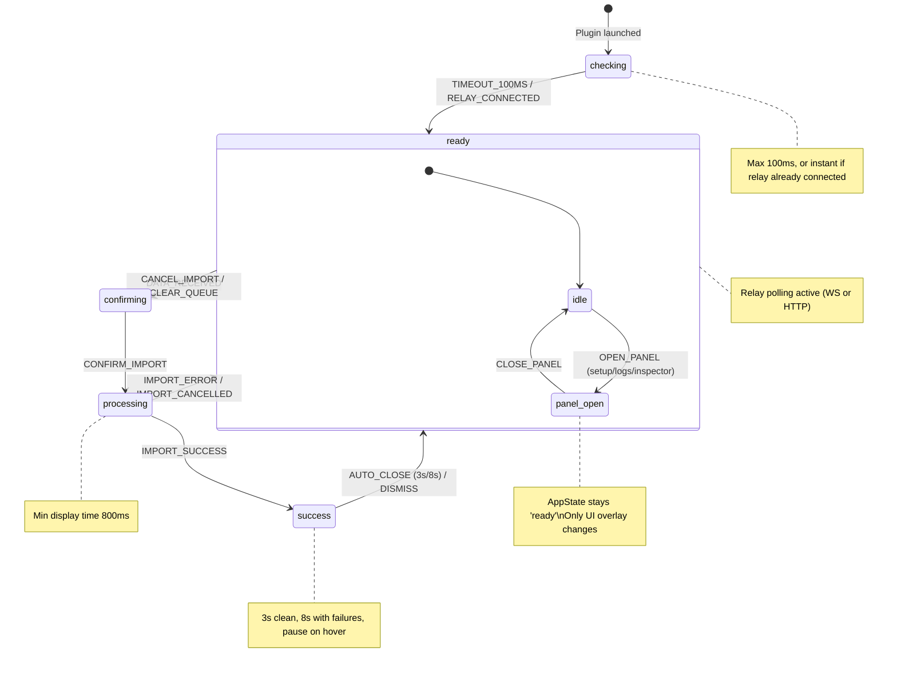

# FSM: UI State Machine Specification

> Formal finite state machine for all Contentify plugin UI states.
> Source of truth for transitions, side effects, and invariants.

---

## States

| State        | UI Tier              | Primary Action       | Description                                                           |
| ------------ | -------------------- | -------------------- | --------------------------------------------------------------------- |
| `checking`   | `compact` (320x56)   | Wait for relay probe | Initial connection check on plugin launch                             |
| `ready`      | `standard` (400x400) | Await incoming data  | Idle state — relay polling active, listening for WebSocket `new-data` |
| `confirming` | `standard` (400x400) | Choose import mode   | ImportConfirmDialog shown with data summary                           |
| `processing` | `standard` (400x400) | Wait for sandbox     | Sandbox executing schema engine + handlers                            |
| `success`    | `standard` (400x400) | Review result        | Auto-closing success view with stats                                  |

**Planned state (Phase 2):**

| State   | UI Tier              | Primary Action      | Description                                         |
| ------- | -------------------- | ------------------- | --------------------------------------------------- |
| `setup` | `extended` (420x520) | Complete onboarding | First-run wizard for Relay + Extension installation |

> Currently `setup` is not a formal AppState. First-run is handled by rendering
> `SetupFlow` inside `ready` when `needsSetup === true` (`!extensionInstalled`).
> Phase 2 promotes it to an explicit AppState.

---

## Transition Table

Every `setAppState()` call in the codebase is accounted for below.

### Main Flow

| #   | From State   | Event            | To State     | Guard                                                           | Side Effects                                                                                                               | Source                                          |
| --- | ------------ | ---------------- | ------------ | --------------------------------------------------------------- | -------------------------------------------------------------------------------------------------------------------------- | ----------------------------------------------- |
| 1   | `checking`   | TIMEOUT_100MS    | `ready`      | `appState === 'checking'` after 100ms                           | `resizeUI('ready')`                                                                                                        | `ui.tsx:212-216`                                |
| 2   | `checking`   | RELAY_CONNECTED  | `ready`      | `appState === 'checking' && relay.connected`                    | `resizeUI('ready')`                                                                                                        | `ui.tsx:222-227`                                |
| 3   | `ready`      | DATA_RECEIVED    | `confirming` | Relay delivers non-empty payload via WS/HTTP                    | `setPending(data)`, `setInfo(...)`, `resizeUI('confirming')`                                                               | `useImportFlow.ts:129`                          |
| 4   | `confirming` | CONFIRM_IMPORT   | `processing` | `pending !== null`                                              | `sendMessageToPlugin('apply-relay-payload')`, `resizeUI('processing')`, start processing timer, safety timeout 30s for ack | `useImportFlow.ts:161`                          |
| 5   | `confirming` | CANCEL_IMPORT    | `ready`      | --                                                              | `relay.blockEntry(entryId)` 10s cooldown, clear pending, `resizeUI('ready')`                                               | `useImportFlow.ts:187`                          |
| 6   | `confirming` | CLEAR_QUEUE      | `ready`      | --                                                              | `relay.clearQueue()`, clear pending + payload, `resizeUI('ready')`                                                         | `useImportFlow.ts:196`                          |
| 7   | `processing` | IMPORT_SUCCESS   | `success`    | `finishProcessing('success')` after MIN_PROCESSING_TIME (800ms) | `setConfettiActive(true)`, `resizeUI('success')`, `relay.ackData(entryId)`                                                 | `useImportFlow.ts:102`                          |
| 8   | `processing` | IMPORT_ERROR     | `ready`      | `finishProcessing('error')` after MIN_PROCESSING_TIME           | `resizeUI('ready')`, clear pending entry                                                                                   | `useImportFlow.ts:105`                          |
| 9   | `processing` | IMPORT_CANCELLED | `ready`      | `finishProcessing('cancel')` after MIN_PROCESSING_TIME          | `resizeUI('ready')`, clear pending entry                                                                                   | `useImportFlow.ts:105`                          |
| 10  | `success`    | AUTO_CLOSE_TIMER | `ready`      | 3s (clean) or 8s (with failures), pausable on hover             | `resizeUI('ready')`                                                                                                        | `useImportFlow.ts:201`, `SuccessView.tsx:21-22` |
| 11  | `success`    | DISMISS_SUCCESS  | `ready`      | User clicks close or logs button                                | `resizeUI('ready')`                                                                                                        | `useImportFlow.ts:201`                          |

### Panel Overlays (do NOT change AppState)

Panels are orthogonal to AppState. Opening a panel stores the current AppState
and resizes the window; closing restores the previous size. AppState remains unchanged.

| #   | Trigger                      | Panel       | Side Effects                                     | Source                                       |
| --- | ---------------------------- | ----------- | ------------------------------------------------ | -------------------------------------------- |
| P1  | Click relay/extension status | `setup`     | `resizeUI('extensionGuide')` (extended)          | `usePanelManager.ts:31-34`                   |
| P2  | Click inspector icon         | `inspector` | `resizeUI('inspector')` (extended)               | `usePanelManager.ts:31-34`                   |
| P3  | `Ctrl+Shift+L` or click      | `logs`      | `resizeUI('logsViewer')` (extended)              | `usePanelManager.ts:31-34`, `ui.tsx:244-251` |
| P4  | Close any panel              | `null`      | `resizeUI(previousAppState)` restores prior size | `usePanelManager.ts:37-42`                   |

---

## State Diagram



---

## Rules

### One Primary Action Per State

| State        | Primary User Action                                 |
| ------------ | --------------------------------------------------- |
| `checking`   | None (passive wait)                                 |
| `ready`      | Switch to Chrome and browse SERP                    |
| `confirming` | Choose import mode: artboard (`Enter`) or selection |
| `processing` | Wait; cancel if stuck (hint after 15s)              |
| `success`    | Review stats; auto-returns to ready                 |

### Timeouts

| State        | Timeout    | Target          | Notes                                                           |
| ------------ | ---------- | --------------- | --------------------------------------------------------------- |
| `checking`   | 100ms      | `ready`         | Unconditional fallback; relay connection may arrive sooner      |
| `processing` | 800ms min  | (display floor) | Ensures processing view is visible long enough for UX           |
| `processing` | 30s safety | ack entry       | If sandbox never responds, ack relay entry to avoid stuck queue |
| `success`    | 3000ms     | `ready`         | Clean import (no failures)                                      |
| `success`    | 8000ms     | `ready`         | Import with partial failures                                    |

### Impossible Transitions (MUST NEVER happen)

| From         | To           | Reason                                                      |
| ------------ | ------------ | ----------------------------------------------------------- |
| `checking`   | `confirming` | Must pass through `ready` first                             |
| `checking`   | `processing` | Must pass through `ready` and `confirming`                  |
| `checking`   | `success`    | Must pass through full import cycle                         |
| `ready`      | `processing` | Must pass through `confirming` (user confirmation required) |
| `ready`      | `success`    | Must pass through `confirming` then `processing`            |
| `confirming` | `success`    | Must pass through `processing`                              |
| `processing` | `confirming` | Cannot go back to confirmation during processing            |
| `success`    | `confirming` | Must return to `ready` first, then receive new data         |
| `success`    | `processing` | Must return to `ready` first                                |

### Relay Polling Guards

Relay data fetching is disabled during certain states to prevent data arriving
while the user is already busy:

```
relay.enabled = appState !== 'processing' && appState !== 'confirming'
```

This means new data from the extension is only picked up in `checking` or `ready` states.

### Panel Invariants

1. Only one panel open at a time (`activePanel` is scalar, not a stack).
2. Panels do NOT change `appState` — they are a UI overlay.
3. Opening a panel saves the current `appState` for size restoration on close.
4. Panels are only accessible from non-`checking` states (StatusBar hidden during `checking`).

---

## Message-to-Transition Mapping

How plugin messages (CodeMessage) trigger state transitions:

| Plugin Message          | Handler                 | Triggers Transition                                          |
| ----------------------- | ----------------------- | ------------------------------------------------------------ |
| `relay-payload-applied` | `onRelayPayloadApplied` | `processing` --> `success` via `finishProcessing('success')` |
| `done`                  | `onDone`                | `processing` --> `success` via `finishProcessing('success')` |
| `error`                 | `onError`               | `processing` --> `ready` via `finishProcessing('error')`     |
| `import-cancelled`      | `onImportCancelled`     | `processing` --> `ready` via `finishProcessing('cancel')`    |
| `stats`                 | `onStats`               | No transition (updates stats in `processing`)                |
| `progress`              | `onProgress`            | No transition (updates stage label in `processing`)          |

How relay events trigger transitions:

| Relay Event                                | Handler              | Triggers Transition                                   |
| ------------------------------------------ | -------------------- | ----------------------------------------------------- |
| WebSocket `new-data` / HTTP poll `hasData` | `onDataReceived`     | `ready` --> `confirming` via `showConfirmation()`     |
| WebSocket connected / HTTP `/status` OK    | `onConnectionChange` | `checking` --> `ready` (via `relay.connected` effect) |

---

## Derived State

These values are computed from AppState and other state, not stored independently:

| Derived Value     | Computation                                              | Used For                                         |
| ----------------- | -------------------------------------------------------- | ------------------------------------------------ |
| `needsSetup`      | `!extensionInstalled`                                    | Show SetupFlow vs ReadyView in `ready` state     |
| `relayConnected`  | `relay.connected` (from hook)                            | StatusBar indicators, reimport button visibility |
| `showMainContent` | `!panels.isPanelOpen`                                    | Toggle between main views and panel overlays     |
| `relay.enabled`   | `appState !== 'processing' && appState !== 'confirming'` | Gate relay data fetching                         |

---

## Related Documents

- [CJM_ONBOARDING.md](CJM_ONBOARDING.md) — onboarding journey map (10 states)
- [CJM_CORE_LOOP.md](CJM_CORE_LOOP.md) — daily usage loop (9 states)
- [ARCHITECTURE.md](ARCHITECTURE.md) — system architecture
- [STRUCTURE.md](STRUCTURE.md) — module structure, UI hooks

## Source Files

- `src/ui/ui.tsx` — main orchestrator, `setAppState` calls for `checking` --> `ready`
- `src/ui/hooks/useImportFlow.ts` — all import lifecycle transitions
- `src/ui/hooks/usePanelManager.ts` — panel overlay state (orthogonal to AppState)
- `src/ui/hooks/useResizeUI.ts` — animated window resize
- `src/ui/hooks/useRelayConnection.ts` — relay polling, WebSocket, data delivery
- `src/types.ts` — `AppState` type, `UI_SIZES`, `STATE_TO_TIER`
