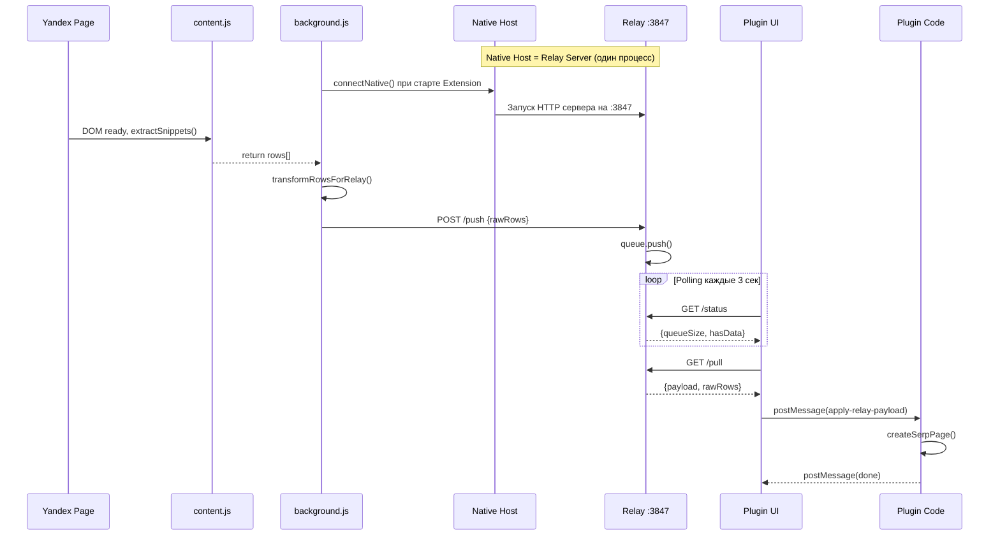

# Data Pipeline Refactor Guide

> Документ для seeding контекста AI-агента при рефакторинге связки Figma Plugin ↔ Browser Extension

## Цель рефакторинга

Упростить первичную настройку для пользователей macOS Apple Silicon:
- **Было**: 7 шагов установки
- **Цель**: 3 шага (скачать → double-click → перезапустить Chrome)

---

## Часть 1: Ограничения платформ

### Figma Plugin API (нельзя обойти)

| Ограничение | Причина |
|-------------|---------|
| Нельзя запускать локальные процессы | Sandbox-окружение |
| Нельзя хранить файлы рядом с плагином | Нет доступа к файловой системе |
| clientStorage — только 5 MB key-value | Не подходит для бинарников |
| Можно только HTTP/WebSocket к localhost | Через allowedDomains в manifest |

### Chrome Extension Manifest V3

| Ограничение | Причина |
|-------------|---------|
| Extension НЕ может быть HTTP сервером | chrome.sockets.tcpServer только для deprecated Chrome Apps |
| Service Worker "засыпает" при простое | MV3 архитектура |
| Native Messaging — единственный способ запустить локальный процесс | Безопасность |

### Вывод

**Relay Server на localhost необходим.** Упростить можно только процесс установки.

---

## Часть 2: Текущая архитектура

### Компоненты системы

| Компонент | Файлы | Назначение |
|-----------|-------|------------|
| Browser Extension | `extension/background.js`, `extension/content.js` | Парсинг Яндекса, отправка на Relay |
| Native Host | `native-host/host.js`, бинарники arm64/x64 | Relay сервер + Native Messaging |
| Relay .app | `native-host/EProductSnippet Relay.app/` | Standalone приложение |
| Install script | `native-host/install-macos.sh` | Установка всех компонентов |
| Plugin Code | `src/code.ts`, `src/plugin/*` | Обработка данных, создание компонентов |
| Plugin UI | `src/ui.tsx`, `src/components/SetupView.tsx` | React-интерфейс, onboarding |

### Поток данных



### Message Types

#### Extension → Relay (HTTP)

| Endpoint | Method | Payload |
|----------|--------|---------|
| `/push` | POST | `{ payload: { schemaVersion, source, items, rawRows }, meta }` |
| `/pull` | GET | — |
| `/status` | GET | — |
| `/health` | GET | — |

#### UI → Plugin (postMessage)

| type | Payload | Описание |
|------|---------|----------|
| `apply-relay-payload` | `{ payload, scope }` | Применить данные из extension |
| `import-csv` | `{ rows, scope }` | Импорт из файла |
| `build-page` | `{ rows, html }` | Создать SERP страницу |
| `cancel-import` | — | Отменить импорт |
| `resize-ui` | `{ width, height }` | Изменить размер окна |
| `get-settings` | — | Запросить настройки |
| `check-selection` | — | Проверить выделение |

#### Plugin → UI (figma.ui.postMessage)

| type | Payload | Описание |
|------|---------|----------|
| `relay-payload-applied` | `{ success, itemCount, frameName }` | Результат импорта |
| `progress` | `{ current, total, message, operationType }` | Прогресс |
| `done` | `{ count }` | Завершено |
| `error` | `{ message }` | Ошибка |
| `selection-status` | `{ hasSelection }` | Статус выделения |
| `settings-loaded` | `{ settings }` | Настройки загружены |

---

## Часть 3: Упрощённый Onboarding

### Текущий UX (7 шагов)

1. Скачать Extension.zip с GitHub
2. Распаковать архив
3. Открыть chrome://extensions
4. Включить Developer Mode
5. Load unpacked → выбрать папку
6. Открыть Terminal, запустить install-macos.sh
7. Перезапустить Chrome

### Целевой UX (3 шага)

1. Скачать `EProductSnippet-Installer.command`
2. Double-click → автоматически устанавливает всё
3. Перезапустить Chrome

### Единый установщик

**Файл**: `scripts/EProductSnippet-Installer.command`

```bash
#!/bin/bash
# EProductSnippet One-Click Installer for macOS
# Double-click в Finder для запуска

set -e

INSTALL_DIR="$HOME/.eproductsnippet"
RELEASE_URL="https://github.com/user/repo/releases/latest/download"

echo ""
echo "🚀 EProductSnippet — Установка"
echo "━━━━━━━━━━━━━━━━━━━━━━━━━━━━━━"
echo ""

# Определяем архитектуру
ARCH=$(uname -m)
if [ "$ARCH" = "arm64" ]; then
  BINARY_NAME="relay-host-arm64"
  echo "📱 Платформа: Apple Silicon (arm64)"
else
  BINARY_NAME="relay-host-x64"
  echo "💻 Платформа: Intel (x64)"
fi
echo ""

# Создаём директорию
mkdir -p "$INSTALL_DIR"
cd "$INSTALL_DIR"

# Скачиваем компоненты
echo "📦 Скачивание компонентов..."
curl -L -# -o extension.zip "$RELEASE_URL/Extension.zip"
curl -L -# -o relay-host "$RELEASE_URL/$BINARY_NAME"
echo ""

# Распаковываем Extension
echo "📂 Распаковка Extension..."
unzip -o -q extension.zip -d extension/
chmod +x relay-host
echo ""

# Устанавливаем Native Messaging Host
echo "🔧 Настройка Native Messaging..."
MANIFEST_DIR="$HOME/Library/Application Support/Google/Chrome/NativeMessagingHosts"
mkdir -p "$MANIFEST_DIR"

# Получаем Extension ID (захардкожен для стабильного ID)
EXTENSION_ID="bkgihkkkahjfjpbplmcpggfnfkckhpnm"

cat > "$MANIFEST_DIR/com.eproductsnippet.relay.json" << EOF
{
  "name": "com.eproductsnippet.relay",
  "description": "EProductSnippet Relay - connects Chrome Extension with Figma Plugin",
  "path": "$INSTALL_DIR/relay-host",
  "type": "stdio",
  "allowed_origins": [
    "chrome-extension://$EXTENSION_ID/"
  ]
}
EOF
echo "   ✅ Native Messaging Host установлен"

# LaunchAgent для автозапуска
echo "🔄 Настройка автозапуска..."
LAUNCH_AGENTS_DIR="$HOME/Library/LaunchAgents"
mkdir -p "$LAUNCH_AGENTS_DIR"
PLIST_PATH="$LAUNCH_AGENTS_DIR/com.eproductsnippet.relay.plist"

cat > "$PLIST_PATH" << EOF
<?xml version="1.0" encoding="UTF-8"?>
<!DOCTYPE plist PUBLIC "-//Apple//DTD PLIST 1.0//EN" "http://www.apple.com/DTDs/PropertyList-1.0.dtd">
<plist version="1.0">
<dict>
    <key>Label</key>
    <string>com.eproductsnippet.relay</string>
    <key>ProgramArguments</key>
    <array>
        <string>$INSTALL_DIR/relay-host</string>
    </array>
    <key>RunAtLoad</key>
    <true/>
    <key>KeepAlive</key>
    <dict>
        <key>SuccessfulExit</key>
        <false/>
    </dict>
    <key>StandardOutPath</key>
    <string>/tmp/eproductsnippet-relay.log</string>
    <key>StandardErrorPath</key>
    <string>/tmp/eproductsnippet-relay.err</string>
</dict>
</plist>
EOF

launchctl unload "$PLIST_PATH" 2>/dev/null || true
launchctl load "$PLIST_PATH"
echo "   ✅ Автозапуск настроен"

# Запускаем Relay
echo ""
echo "🚀 Запуск Relay сервера..."
if lsof -i :3847 >/dev/null 2>&1; then
  echo "   ✅ Relay уже работает на порту 3847"
else
  launchctl start com.eproductsnippet.relay 2>/dev/null || true
  sleep 1
  if lsof -i :3847 >/dev/null 2>&1; then
    echo "   ✅ Relay запущен на порту 3847"
  else
    echo "   ⚠️  Relay запустится при следующем входе в систему"
  fi
fi

# Инструкция
echo ""
echo "━━━━━━━━━━━━━━━━━━━━━━━━━━━━━━"
echo "✅ Установка завершена!"
echo ""
echo "📌 Осталось установить расширение в Chrome:"
echo ""
echo "   1. Откройте: chrome://extensions"
echo "   2. Включите 'Developer mode' (справа вверху)"
echo "   3. Нажмите 'Load unpacked'"
echo "   4. Выберите папку:"
echo "      $INSTALL_DIR/extension"
echo ""
echo "   5. Перезапустите Chrome"
echo ""
echo "━━━━━━━━━━━━━━━━━━━━━━━━━━━━━━"
echo ""

# Открываем Finder с папкой extension
open "$INSTALL_DIR/extension"

read -p "Нажмите Enter для выхода..."
```

---

## Часть 4: SetupView v2

**Файл**: `src/components/SetupView.tsx`

### Текущие проблемы

1. **Placeholder URLs** (строки 16-17): заглушки вместо реальных ссылок
2. **Нет автопроверки**: не показывает, какие шаги выполнены
3. **Избыточные шаги**: "Перезапустите Chrome" не нужен как отдельный шаг

### Новая логика

```typescript
// URLs для скачивания
const INSTALLER_URL = 'https://github.com/user/repo/releases/latest/download/EProductSnippet-Installer.command';

// Состояние подключения
interface ConnectionState {
  relayConnected: boolean;
  relayChecking: boolean;
  lastPushAt: string | null;  // когда Extension последний раз отправлял данные
}

// Автопроверка статуса
const checkConnectionStatus = async (): Promise<ConnectionState> => {
  try {
    const controller = new AbortController();
    setTimeout(() => controller.abort(), 2000);
    
    const res = await fetch('http://localhost:3847/health', {
      signal: controller.signal
    });
    
    if (!res.ok) {
      return { relayConnected: false, relayChecking: false, lastPushAt: null };
    }
    
    const data = await res.json();
    return {
      relayConnected: true,
      relayChecking: false,
      lastPushAt: data.lastPushAt || null
    };
  } catch {
    return { relayConnected: false, relayChecking: false, lastPushAt: null };
  }
};
```

### UI состояния

**Relay не подключён:**
```
┌─────────────────────────────────────┐
│  ⚠️  Настройка подключения          │
│                                     │
│  ┌─────────────────────────────────┐│
│  │ [!] Relay не запущен            ││
│  │                                 ││
│  │ Скачайте и запустите            ││
│  │ установщик:                     ││
│  │                                 ││
│  │ [📥 Скачать установщик]         ││
│  └─────────────────────────────────┘│
│                                     │
│  [Проверить подключение]            │
└─────────────────────────────────────┘
```

**Relay подключён, ждём Extension:**
```
┌─────────────────────────────────────┐
│  ⏳ Ожидание данных                 │
│                                     │
│  ┌─────────────────────────────────┐│
│  │ [✓] Relay: подключён            ││
│  └─────────────────────────────────┘│
│                                     │
│  ┌─────────────────────────────────┐│
│  │ [?] Расширение: ожидание        ││
│  │                                 ││
│  │ Откройте страницу Яндекса       ││
│  │ и кликните на иконку            ││
│  │ расширения                      ││
│  └─────────────────────────────────┘│
└─────────────────────────────────────┘
```

**Всё работает:**
```
┌─────────────────────────────────────┐
│  ✅ Готов к работе                  │
│                                     │
│  ┌─────────────────────────────────┐│
│  │ [✓] Relay: подключён            ││
│  │ [✓] Расширение: активно         ││
│  └─────────────────────────────────┘│
│                                     │
│  Откройте Яндекс, найдите товар    │
│  и кликните на иконку расширения   │
└─────────────────────────────────────┘
```

---

## Часть 5: Deeplink для Relay.app

**Файл**: `native-host/EProductSnippet Relay.app/Contents/Info.plist`

Добавить URL scheme для запуска приложения из плагина:

```xml
<key>CFBundleURLTypes</key>
<array>
  <dict>
    <key>CFBundleURLName</key>
    <string>EProductSnippet Relay</string>
    <key>CFBundleURLSchemes</key>
    <array>
      <string>eproductsnippet</string>
    </array>
  </dict>
</array>
```

Использование из плагина:

```typescript
// Если Relay не отвечает, пробуем запустить через deeplink
const tryStartRelay = () => {
  window.open('eproductsnippet://start');
};
```

---

## Часть 6: GitHub Release

### Структура assets

| Файл | Описание | Размер |
|------|----------|--------|
| `EProductSnippet-Installer.command` | Единый установщик | ~3 KB |
| `Extension.zip` | Chrome Extension | ~50 KB |
| `relay-host-arm64` | Бинарник Apple Silicon | ~15 MB |
| `relay-host-x64` | Бинарник Intel | ~15 MB |

### GitHub Actions workflow

**Файл**: `.github/workflows/release.yml`

```yaml
name: Release

on:
  push:
    tags:
      - 'v*'

jobs:
  build:
    runs-on: macos-latest
    steps:
      - uses: actions/checkout@v4
      
      - name: Setup Node.js
        uses: actions/setup-node@v4
        with:
          node-version: '20'
      
      - name: Install dependencies
        run: npm ci
        working-directory: native-host
      
      - name: Build binaries
        run: npm run build
        working-directory: native-host
      
      - name: Package Extension
        run: |
          cd extension
          zip -r ../Extension.zip .
      
      - name: Create Release
        uses: softprops/action-gh-release@v1
        with:
          files: |
            scripts/EProductSnippet-Installer.command
            Extension.zip
            native-host/dist/relay-host-arm64
            native-host/dist/relay-host-x64
```

---

## Часть 7: Приоритизированные TODO

### P0 — Критично для упрощения onboarding

| # | Задача | Файл | Строки |
|---|--------|------|--------|
| 1 | Создать `EProductSnippet-Installer.command` | `scripts/installer.command` | новый файл |
| 2 | Добавить `lastPushAt` в /health endpoint | `native-host/host.js` | ~95 |
| 3 | Редизайн SetupView с автопроверкой | `src/components/SetupView.tsx` | полный рефакторинг |
| 4 | Заменить placeholder URLs | `src/components/SetupView.tsx` | 16-17 |
| 5 | Добавить CFBundleURLSchemes | `native-host/.../Info.plist` | новые строки |
| 6 | Настроить GitHub Actions | `.github/workflows/release.yml` | новый файл |

### P1 — Улучшение UX

| # | Задача | Файл |
|---|--------|------|
| 7 | Кнопка "Запустить Relay" с deeplink | `SetupView.tsx` |
| 8 | Индикация времени последнего push | `SetupView.tsx` |
| 9 | Убрать дублирование items + rawRows | `extension/background.js:132-151` |

### P2 — Технический долг

| # | Задача | Файл |
|---|--------|------|
| 10 | Заменить polling на SSE | `ui.tsx`, `host.js` |
| 11 | Разбить content.js на модули | `extension/content.js` (2100+ строк) |
| 12 | Мигрировать extension на TypeScript | `extension/*.js` |

---

## Часть 8: Ключевые сниппеты для изменений

### SetupView.tsx — placeholder URLs (строки 16-17)

```typescript
// ТЕКУЩИЙ КОД (заменить):
const EXTENSION_GITHUB_URL = 'https://github.com/user/repo/releases';
const RELAY_APP_URL = 'https://github.com/user/repo/releases';

// НОВЫЙ КОД:
const INSTALLER_URL = 'https://github.com/YOUR_USERNAME/fluffy-chainsaw/releases/latest/download/EProductSnippet-Installer.command';
```

### host.js — добавить lastPushAt (около строки 31)

```javascript
// ТЕКУЩИЙ КОД:
app.post('/push', (req, res) => {
  const { payload, meta } = req.body;
  // ...
});

// ДОБАВИТЬ переменную:
let lastPushTimestamp = null;

app.post('/push', (req, res) => {
  const { payload, meta } = req.body;
  lastPushTimestamp = new Date().toISOString();  // NEW
  // ...
});

// ИЗМЕНИТЬ /health:
app.get('/health', (req, res) => {
  res.json({ 
    status: 'ok', 
    queueSize: dataQueue.length,
    lastPushAt: lastPushTimestamp  // NEW
  });
});
```

### background.js — убрать дублирование (строки 132-151)

```javascript
// ТЕКУЩИЙ КОД (избыточный):
function transformRowsForRelay(rows) {
  return rows.map(row => ({
    title: row['#OrganicTitle'] || '',
    priceText: row['#OrganicPrice'] ? `${row['#OrganicPrice']} ${row['#Currency'] || '₽'}` : '',
    // ... много полей ...
    _rawCSVRow: row  // единственное нужное
  }));
}

// УПРОЩЁННЫЙ КОД:
function transformRowsForRelay(rows) {
  // items больше не нужны — плагин использует только rawRows
  return rows.map(row => ({ _rawCSVRow: row }));
}
```

---

## Использование этого документа

1. **Для seeding**: скопировать весь документ в контекст агента перед началом рефакторинга
2. **Для thread memory**: сохранить ключевые решения (ограничения, архитектура, TODO)
3. **Для review**: использовать P0/P1/P2 приоритеты для планирования спринтов
